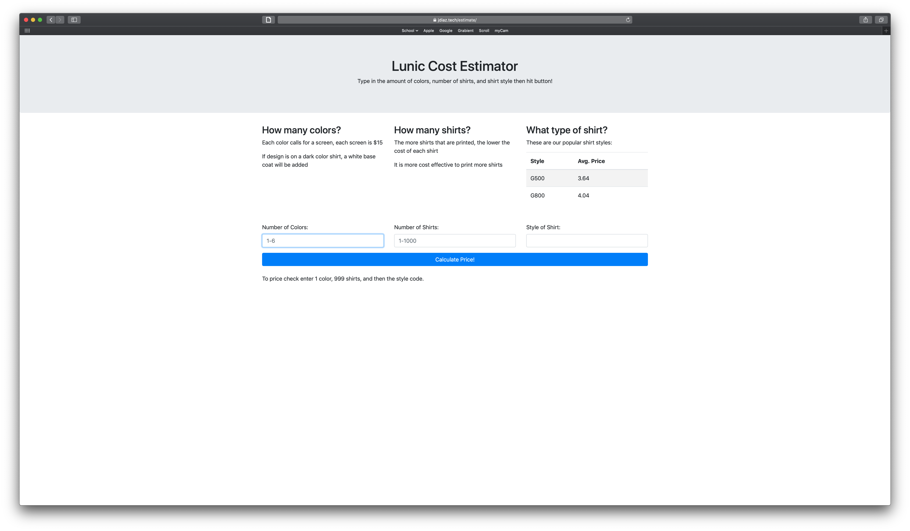
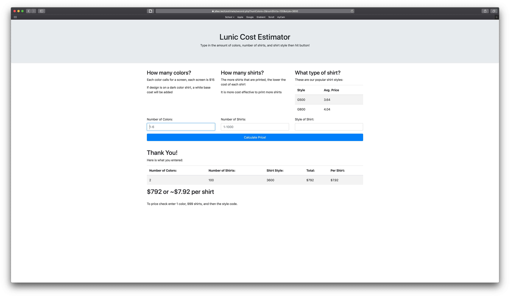
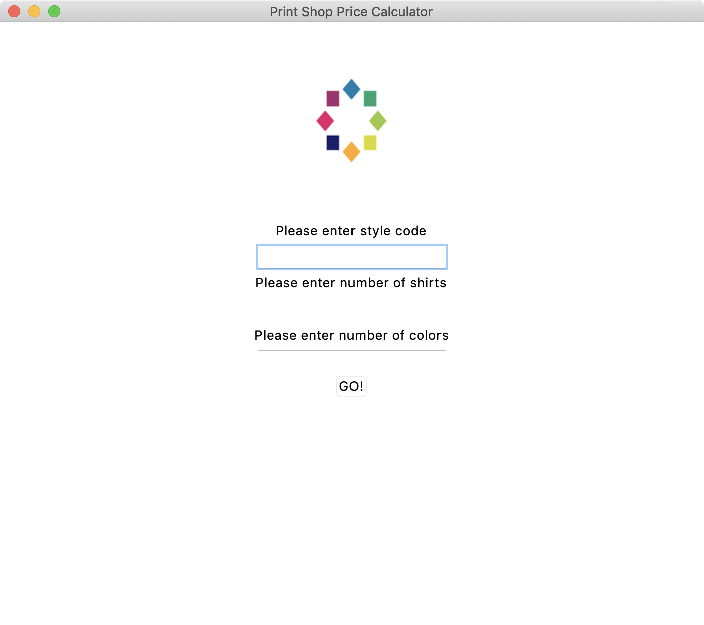
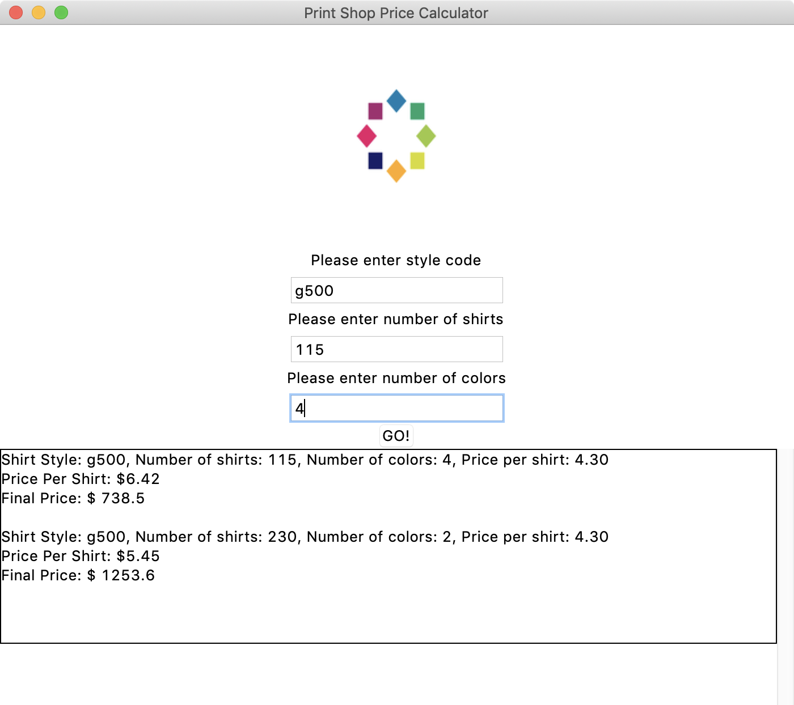

# printShop

### Did again with PHP and now lives on the web

- [Click here to check it out](https://jdiaz.tech/estimate/)
- Made with PHP and Bootstrap 4 for styling
- Easy to use and pretty!

### What it does:

- This program returns the cost for a print job including the cost of the shirt
- It does this by using the apparel distributor's API to grab the cost of the shirt and then completing the necessary math to give the end cost

### The program as is, is NOT functional.

The necessary credentials for the API are left out and as such it will not run. In order to get these credentials you must register your business with the apparel distributor

### Screenshots

